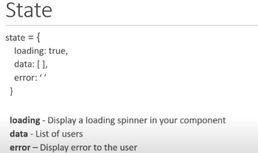
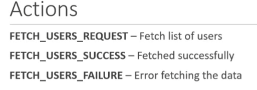

# Redux-tutorial-codevolution

These notes and code is copied from codevolution youtube video. This repo is only for practice. if needed to understand from the video please check https://youtube.com/playlist?list=PLC3y8-rFHvwheJHvseC3I0HuYI2f46oAK&si=pXThOoaSEIiTvL-V youtube playlist link from codevolution.

## Introduction

1. For this just get to know first fundamentals of react.
2. redux is a library. redux is a predictable state container for javascript apps.
3. redux is used gfor javascript application and used with any framework of javascript.
4. it is a state container. stores the state of application. state of an app is the state represented by all the individual components of the app.

for example:

LoginFormComponent

state = {
    username:``,
    password:``,
    submitting:false
}

the state of component is simply a object in here and state of component would be an objectthat contains an array of users.

UserFormComponent

state={
    users:[]
}

if the application size is medium to large then the state will be

Application

state={
    isUserLoggedIm:true,
    username:'Nidhi',
    profileUrl:'',
    onlineUsers:[],
    isModeOpened: false
}

5. redux will store and manage the application state.
6. redux is a state container and state of the application can change. for example todo list app item(pending) -> item(completed). item can go from being in a state of pending to a state of completed.
7. all state transitions are explicit and it is porssible to keep track of them.
8. react has their own state management. but it can be difficult when we have to share some particular data to many components and the sharing can be on nested levels. 

in this situation redux can help out. With redux state is contained outside of the components. if component wants to update the state it communicates with the state container, the state container updates the state in a predicatbale manner and then sends this value to only those components that are in need  of that value.


as we know from react that useContext and useReducer is almost same as redux. React Context prevents prop driling. so in place of redux we can use react context, useContext and useReducer hooks.

9. react is a UI library and redux is a state management library. they both work independently. directly using redux in a react application is difficult thats why there we use react-redux package "React-Redux" the official redux UI binding library for react. in that few functions will helps to connect with redux in application.


## Getting started

1. install nodeJS in the system, create react app / create folder and have pacakge.json file using npm init command.
2. need redux as a dependancy in the project (folder jsut created). so for that run command

`npm install redux`

3. after complete installation dependancy will get mentioned in package.json.
4. now create a JS file to write a code. 

`console.log("From index.js")`

run the command in terminal of that code file's directory.

`node index.js`

output will come "From index.js"

now the setup is complete for now

## Three Principles


1. 


2. if want to change the state then let redux know about this action, dont change directly the state.


3. reducer is the shopkeeper, so tell the shopkeeper that you want to buy the cake and other requirements, then he will take one cake from the shelf, pack it and gives you the reciept under the cake. number of cake from the self of the store also reduced.

same in JS application would be the function that accepts the current state and action. based on what action type is new state object is returned.


so redux is subscribed to the app. if app wnats to update the state then it can be applied directly. first app will dispatch the Action, reducer handles the state want to update and action want to apply, then redux state will get updated once reducer work is done and the output can be seen in the application.


## Actions

1. the only way application can interatc with the store
2. carry information from app to the redux store
3. actions are plain JS objects
4. Have a 'type' property that indicates the type of action being performed and 'type' property is typically defined as string constants.

Check index.js file from the Code directory.
here we create a action and action creator.

```
const BUY_CAKE = 'BUY_CAKE'

//action is an object with type property and action creator is a function that returns an action

function buyCake(){
    return {
        type: BUY_CAKE,
        info: 'First redux action'
    }
}
```

## Reducers

1. Specify how the app's state changes in response to actions sent to the store
2. Function that accepts state and action as arguments, and returns the next state of the application

(previousState,action) => newState

```
const initailState = {
    numofCakes: 10
}

const reudcer = (state = initailState,action) =>{
    switch(action.type) {
        case BUY_CAKE:return{
            ...state,
            numofCakes: state.numofCakes - 1
        }
        default: return state
    }
}
```

## Store

1. one store for the entire application
2. Responsibilities:
    a. holds application state
    b. allowas access to state via getState()
    c. allows state to be updated via dispatch(action)
    d. registers listeners via subscribe(listener)
    e. handles unregistering of listeners via the function returned by subscibe(listener)

```
const store = createStore(reducer)
console.log('Initial state ', store.getState());
const unsubscribe = store.subscribe(() => console.log('updated state ',store.getState()))
store.dispatch(buyCake())
store.dispatch(buyCake())
store.dispatch(buyCake())
unsubscribe()
```
### steps for redux store
1. create a store
2. decalre the inital state and the reducer
3. define your actions and action creators
4. subscribe to the store
5. dispatch actions to update the store
6. unsubscribe to the changes

## Cakes and Ice creams


if we divide the work then its easier to maintain the operations. thats what it says in the next application

## Multiple Reducer

1. before mulitple reducer we learn how to handle single reducer. 
2. now we sell cake and icecream both so for that we create variables,action creator, switch cases in the reducer, intialize those action creators for both cake and icecream.

```
// import redux from 'redux'
const redux = require('redux')
const createStore = redux.legacy_createStore

const BUY_CAKE = 'BUY_CAKE'
const BUY_ICECREAMS = 'BUY_ICECREAMS'

//action is an object with type property and action creator is a function that returns an action

function buyCake(){
    return {
        type: BUY_CAKE,
    }
}
function buyIcecreams(){
    return {
        type: BUY_ICECREAMS,
    }
}
//(previousState, action) => newState

const initialState = {
    numofCakes: 10,
    numofIcecreams: 20
}

const reducer = (state = initialState,action) =>{
    switch(action.type) {
        case BUY_CAKE:return{
            ...state,
            numofCakes: state.numofCakes - 1
        }
        case BUY_ICECREAMS:return{
            ...state,
            numofIcecreams: state.numofIcecreams - 1
        }
        default: return state
    }
}

//redux store
const store = createStore(reducer)
console.log('Initial state ', store.getState());
const unsubscribe = store.subscribe(() => console.log('updated state ',store.getState()))
store.dispatch(buyCake())
store.dispatch(buyCake())
store.dispatch(buyCake())
store.dispatch(buyIcecreams())
store.dispatch(buyIcecreams())
unsubscribe()
```

3. single reducer will work for only less number of conditions and states. for large number of states its difficult to manage.
4. so there is another approach to handle multiple states using mutiple reducers.
5. for multiple reducer we split states and reducers, so now we have 2 object of inital state in place of 2. then combine the reducer using combineReducer and then initialize the combineReducer in the createReducer. follow the below code flow. its a simpler and managable method.

```
// import redux from 'redux'
const redux = require('redux')
const createStore = redux.legacy_createStore

const BUY_CAKE = 'BUY_CAKE'
const BUY_ICECREAMS = 'BUY_ICECREAMS'

//action is an object with type property and action creator is a function that returns an action

function buyCake(){
    return {
        type: BUY_CAKE,
    }
}
function buyIcecreams(){
    return {
        type: BUY_ICECREAMS,
    }
}
//(previousState, action) => newState

//for multiple reducer
const initialCakeState = {
    numofCakes: 10
}

const initialIceCreamState = {
    numofIcecreams: 10
}

const cakereducer = (state = initialCakeState,action) =>{
    switch(action.type) {
        case BUY_CAKE:return{
            ...state,
            numofCakes: state.numofCakes - 1
        }
        default: return state
    }
}

const icecreamreducer = (state = initialIceCreamState,action) =>{
    switch(action.type) {
        case BUY_ICECREAMS:return{
            ...state,
            numofIcecreams: state.numofIcecreams - 1
        }
        default: return state
    }
}

//redux store
const rootReducer = combineReducer({
    cake: cakereducer,
    icecream: icecreamreducer
})

const store = createStore(rootReducer)
console.log('Initial state ', store.getState());
const unsubscribe = store.subscribe(() => console.log('updated state ',store.getState()))
store.dispatch(buyCake())
store.dispatch(buyCake())
store.dispatch(buyCake())
store.dispatch(buyIcecreams())
store.dispatch(buyIcecreams())
unsubscribe()
```

6. if we want to access the state value of cake then it goes 
`state.cake.numofCakes`
same for icecream
`state.iceCream.numofIceCreams`

7. when app grows in size, split the reducers into separate files and keep them completely independent and managing different areas.

## Middleware

1. suggested way to extend Redux with custom functionality
2. provides a 3rd party extension point between dispatching an action and the moment it reaches the reducer
3. use middleware for logging, crash reporting, performing asynchronous tasks etc.
4. the middleware in this application is Redux-logger library. it logs all the formation related to redux. to install package run command

`npm i --save redux-logger`

next create logger in application.
5. here we use logger as a middleware and for creating the logger import the reduxlogger in the application and create a middleware

```
const reduxLogger = require('redux-logger')
const logger = reduxLogger.createLogger()
```

6. for applying the middleware in the reducer first import applyMiddleware from redux
`const applyMiddleware =  redux.applyMiddleware`
then, apply middleware in reducer 
```
const store = createStore(rootReducer,applyMiddleware(logger))
```

add as much as middleware in this.
Next remove the log from the subscription

## Async Actions

### synchronous actions
1. as soon as an action was dispatched, the state was immediately updated.
2. if you dispatch the BUY_CAKE action, the numOfCakes was right away decremented by 1. Same with BUY_ICECREAMS action as well.

### Async Actions
asynchronous api calls to fetch data from an endpoint and use that data in your application.







```
const redux = require('redux')
const createStore = redux.legacy_createStore

const initialState={
    loading: false,
    users: [],
    error: ''
}

const FETCH_USERS_REQUEST = 'FETCH_USERS_REQUEST'
const FETCH_USERS_SUCCESS = 'FETCH_USERS_SUCCESS'
const FETCH_USERS_FAILURE = 'FETCH_USERS_FAILURE'

const fetchUserRequest = () => {
    return {
        type: FETCH_USERS_REQUEST
    }
}

const fetchUserSuccess = users => {
    return {
        type: FETCH_USERS_SUCCESS,
        payload: users
    }
}

const fetchUserFailure = error => {
    return {
        type: FETCH_USERS_FAILURE,
        payload: error
    }
}

const reducer = (state = initialState, action) => {
    switch(action.type) {
        case FETCH_USERS_REQUEST:
            return {
                ...state,
                loading: true
            }
        case FETCH_USERS_SUCCESS:
            return {
                loading: false,
                users: action.payload,
                error: ''
            }
        case FETCH_USERS_FAILURE:
            return {
                loading: false,
                users: [],
                error: action.payload
            }
    }
}

const store = createStore(reducer)

```

### async action creators


using above mentioned creators we'll do the API call

1. first install axios and redux-thunk using below command
`npm install axios redux-thunk`
2. write a code like this
```
const redux = require("redux");
const createStore = redux.legacy_createStore;
const applyMiddleware = redux.applyMiddleware;
const thunkMiddleware = require("redux-thunk").default;
const axios = require("axios");

const initialState = {
  loading: false,
  users: [],
  error: "",
};

const FETCH_USERS_REQUEST = "FETCH_USERS_REQUEST";
const FETCH_USERS_SUCCESS = "FETCH_USERS_SUCCESS";
const FETCH_USERS_FAILURE = "FETCH_USERS_FAILURE";

const fetchUserRequest = () => {
  return {
    type: FETCH_USERS_REQUEST,
  };
};

const fetchUserSuccess = (users) => {
  return {
    type: FETCH_USERS_SUCCESS,
    payload: users,
  };
};

const fetchUserFailure = (error) => {
  return {
    type: FETCH_USERS_FAILURE,
    payload: error,
  };
};

const reducer = (state = initialState, action) => {
  switch (action.type) {
    case FETCH_USERS_REQUEST:
      return {
        ...state,
        loading: true,
      };
    case FETCH_USERS_SUCCESS:
      return {
        loading: false,
        users: action.payload,
        error: "",
      };
    case FETCH_USERS_FAILURE:
      return {
        loading: false,
        users: [],
        error: action.payload,
      };

    default:
      return state;
  }
};

const fetchUsers = () => {
  return function (dispatch) {
    dispatch(fetchUserRequest());
    axios
      .get("https://jsonplaceholder.typicode.com/users")
      .then((response) => {
        // response.data
        const users = response.data.map((user) => user.id);
        dispatch(fetchUserSuccess(users));
      })
      .catch((error) => {
        // error.message
        dispatch(fetchUserFailure(error.message));
      });
  };
};

const store = createStore(reducer, applyMiddleware(thunkMiddleware));
store.subscribe(() => {
  console.log(store.getState());
});
store.dispatch(fetchUsers());

```

## React-redux Library

1. learn this with react application


2. create react app, install redux and react-redux.
3. create a CakeComponent in the components directory
4. create a button and text in the CakeComponent 
5. import CakeComponent in the app.js
6. create redux->cake->cakeActions.js,cakeTypes.js file structure
7. create a action creator in cakeActions.js and string variable in cakeType.js
8. import the cakeTypes.js variable in the action creator function to make action type constant.( check the code )
9. create a reducer cakeReducer.js. give the intialState for the cakestate. create cakeReducer functional component and follow the structure same as before
10. next create store.js file in redux folder. import cakeReducer into createstore and provide store in App.js
11. just like actions and reducers there is selectors in the react redux application to return some state information from redux store.
13. in this application we mention that state as `state.numOfCakes` in mapStateToProps function but in bigger application it will be in a separate file called selectors.
14. now create mapDispatchToProps to dispatch the buyCake(). create index.js file in redux folder, import buyCake component in that and then import buyCake in CakeConatiner from redux folder
15. now connect with higher order component react redux library.
16. use comnnect from redux. connect function is basically, 2 function name specify. In the mapStateToProps function the state from redux store is mapped to our component props so apart from whatever props cake container was receving it will now receive an additional prop called number of cakes which refelct number of cakes in the redux store in the h2 tag.

Similarly mapDispatchToProps will map our dispatch of an action creator to a prop in our component ,so our component receives a second additional prop called buyCake() which will dispatch the buyCake action in button onclick attribute